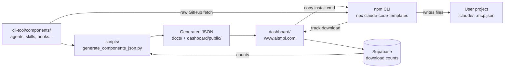
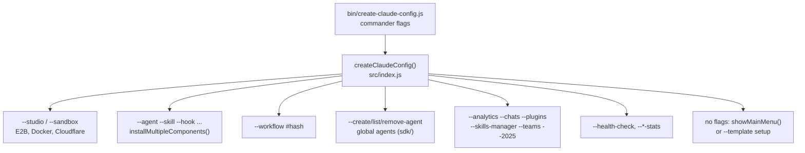

# claude-code-templates: Codebase Guide

As of 2026-09-25.

## The big picture

The repo is one product with three faces. A library of Claude Code components (plain files under `cli-tool/components/`), an npm CLI (`claude-code-templates` / `cct`) that installs them, and a website (www.aitmpl.com) to browse them. Everything else is plumbing that keeps those three in sync.

The key fact: **the CLI does not ship the components.** The npm package holds only `cli-tool/bin/`, `cli-tool/src/` and the sandbox component. At install time the CLI fetches each file from `raw.githubusercontent.com/davila7/claude-code-templates/main/cli-tool/components/...`. So a component merged to `main` is instantly installable, with no npm release.

Read it left to right: a component file on `main` is scanned into JSON, the site renders that JSON, the user copies a command, and the CLI pulls the same file from GitHub into their project. Each install pings `/api/track-download-supabase`, and those counts flow back into the catalog on the next daily regeneration.

## Top-level directory map

`cli-tool/` holds 7,200 of the repo's ~9,600 tracked files, and 5,700 of those are skills. The rest of the tree is small and single-purpose.

| Path | What it owns | Notes |
| --- | --- | --- |
| `cli-tool/components/` | The component library (agents, commands, skills, hooks, MCPs, settings, loops, mods, sandbox) | Source of truth for everything the site shows and the CLI installs |
| `cli-tool/bin/`, `cli-tool/src/` | The Node CLI | Only these ship in the npm package (see root `package.json` `files`) |
| `cli-tool/templates/` | Language starter configs: `common`, `javascript-typescript`, `python`, `ruby`, `go`, `rust` | Used by the interactive / `--template` setup flow |
| `cli-tool/analytics-ui/` | Astro source for the local analytics dashboard | Builds into `cli-tool/src/analytics-web/` |
| `cli-tool/tests/` | Jest tests: `unit/`, `integration/`, `validation/`, `skills/` | Config in `cli-tool/jest.config.js` |
| `cli-tool/docs_to_claude/` | Internal design notes (hooks, statuslines, analytics state detection, download tracking) | Background reading, not shipped |
| `dashboard/` | Astro 5 + React site and all API routes for www / app.aitmpl.com | Deployed to Cloudflare Pages |
| `scripts/` | Python + Node build scripts: catalog, trending, plugins, star history, version sync, SkillSpector | Catalog generator is the important one |
| `docs/` | Legacy static site + the full `components.json` + blog source | Only on GitHub Pages now; blog must be mirrored to `dashboard/public/blog/` |
| `cloudflare-workers/` | `crons`, `pulse`, `newsletter`, `daily-health-report`, `docs-monitor` | Independent Workers, each with its own `wrangler.toml` |
| `cli-rust/` | A Rust port of the CLI (Cargo project + `npm/` wrapper) | Built by `build-rust-cli.yml` / `rust-ci.yml` |
| `database/migrations/` | SQL migrations | For the Neon / Supabase tables the APIs use |
| `.github/` | 18 workflows, CODEOWNERS, dependabot, `WORKFLOWS_REFERENCE.md` | Covered in the CI/CD section |
| `.claude/` | This repo's own Claude Code setup: 15 agents, 3 commands, rules, a hook | Tools for maintaining the repo, not catalog items |
| `.claude-plugin/` | One packaged skill (`skills/owasp-security/`) with `skill.json` | Not a marketplace manifest |
| Root files | `package.json` (npm package), `CLAUDE.md`, `CONTRIBUTING.md`, `.env.example`, `.mcp.json` (Linear + Neon MCPs) | `package.json` version is synced to `cli-tool/package.json` by `scripts/sync-package-versions.js` |

## Component library (`cli-tool/components/`)

Every component lives at `cli-tool/components/{type}/{category}/{name}`, and that path minus the extension is its install id (`--agent development-team/backend-architect`). The category folder is only for organisation: agents and commands install flat into `.claude/agents/` and `.claude/commands/`.

| Type | Count (Sep 2026) | Source format | CLI flag | Installed to |
| --- | --- | --- | --- | --- |
| Skills | 912 `SKILL.md` | Directory: `SKILL.md` (YAML frontmatter) + `references/`, scripts, assets | `--skill` | `.claude/skills/{name}/` (whole directory, via GitHub contents API) |
| Agents | 424 | `.md` with frontmatter `name`, `description`, `tools` | `--agent` | `.claude/agents/{name}.md` |
| Commands | 348 | `.md` with frontmatter `allowed-tools`, `argument-hint`, `description`; body uses `$ARGUMENTS` | `--command` | `.claude/commands/{name}.md` |
| MCPs | 104 | `.json` with `mcpServers` | `--mcp` | Merged into `.mcp.json` (each server's `description` stripped) |
| Settings | 72 | `.json` fragment of `settings.json` (`permissions`, `env`, `statusLine`, `model`...) | `--setting` | User, project, local or enterprise `settings*.json` (user picks); statuslines also pull `.py` into `.claude/scripts/` |
| Hooks | 62 (+24 `.py`/`.sh` scripts) | `.json` with a `hooks` block keyed by event (`PreToolUse`, `PostToolUse`...) | `--hook` | Merged into chosen `settings*.json`; sibling `.py`/`.sh` go to `.claude/hooks/` |
| Mods | 29 plugin dirs in 10 categories | Plugin directory: `.claude-plugin/plugin.json`, `hooks/hooks.json`, TS/JS hook modules, `README.md` | `--mod` | `.claude/skills/{name}/`, loaded as `{name}@skills-dir` in a trusted project |
| Loops | 18 | `.md`; frontmatter has `interval`, `stop-condition`, `components: [agent:..., hook:...]` | `--loop` | `.claude/loops/`, then every referenced component is installed too |
| Sandbox | 3 providers (`e2b`, `docker`, `cloudflare`) | Launcher scripts + requirements | `--sandbox` | Not installed; shipped inside the npm package and run from there |

Things worth knowing:

- **Metadata comes from frontmatter or the `description` key.** The catalog generator reads those, so a bad frontmatter block means a bad card on the site.
- **Hooks and settings share a merge path.** Both are JSON fragments that get deep-merged into a settings file; the CLI also rewrites `python3` to the right interpreter on Windows (`replacePythonCommands`).
- **Mods are the one type with its own toolchain.** `mods/tsconfig.json` + `mods/types/claude-code.d.ts` typecheck every module (CI: `mods-typecheck.yml`). They need Claude Code 2.1.259+ and `CLAUDE_CODE_ENABLE_FUNCTION_HOOKS=1`.
- **Skills are scanned for security.** SkillSpector runs on changed skills in PRs and blocks HIGH/CRITICAL scores.
- **Loops are composites.** `parseLoopReferencedComponents()` in `src/index.js` reads the `components:` line and installs each reference.
- Supporting files: `hooks/HOOK_PATTERNS_COMPRESSED.json`, `skills/ANTHROPIC_ATTRIBUTION.md`, `mods/README.md`, `sandbox/README.md`.

## The npm CLI (`cli-tool/bin` + `cli-tool/src`)

The CLI is a CommonJS Node app built on `commander`. `bin/create-claude-config.js` declares ~50 flags, prints the banner (`tui.js`), and hands the parsed options to one function: `createClaudeConfig()` in `src/index.js`. That function is a long `if` ladder; the first matching flag wins and returns.

### The install path (what 90% of usage hits)

1. `installMultipleComponents()` splits each flag on commas into eight lists and generates a `batchId`.
2. It calls one `installIndividual{Agent,Command,MCP,Setting,Hook,Skill,Mod,Loop}()` per item. All live in `src/index.js` (lines ~480–1920).
3. Each installer fetches from GitHub `main`: single files via `raw.githubusercontent.com`, directories (skills, mods) via the GitHub contents API, recursively.
4. It writes or merges into the target project (table in the section above). Settings and hooks prompt for location: user `~/.claude/settings.json`, project `.claude/settings.json`, local `.claude/settings.local.json`, or enterprise `managed-settings.json`.
5. `tracking-service.js` posts to `https://www.aitmpl.com/api/track-download-supabase` and `/api/track-installation-outcome`. It is anonymous, on by default, and disabled by `CCT_NO_TRACKING`, `CCT_NO_ANALYTICS` or `CI`.
6. If `--prompt` was passed, `handlePromptExecution()` then runs Claude Code with it.

### `src/` module map

| Module | Role |
| --- | --- |
| `index.js` (3,700 lines) | Dispatcher, every installer, workflows, sandboxes, template setup |
| `tui.js`, `prompts.js` | Banner, main menu and inquirer prompts for the interactive flow |
| `templates.js`, `file-operations.js`, `utils.js` | `TEMPLATES_CONFIG` (language templates), template copying, project/framework detection |
| `command-scanner.js`, `hook-scanner.js`, `agents.js` | Discover available commands/hooks/agents for a template |
| `command-stats.js`, `hook-stats.js`, `mcp-stats.js` | `--*-stats`: analyse what a project already has, estimate token cost |
| `health-check.js` | `--health-check`: validates Node, Claude Code install, config, project setup |
| `analytics.js` + `analytics/` | `--analytics` / `--agents` / `--2025`: Express + WebSocket server on `localhost:3333` reading `~/.claude` session logs. `analytics/core/` has the analyzers (conversation, session, agent, process detection, state), `data/DataCache.js`, `notifications/` |
| `analytics-web/` | Built frontend for that server (source is `cli-tool/analytics-ui/`, Astro) |
| `chats-mobile.js`, `console-bridge.js`, `claude-api-proxy.js` | `--chats`: mobile chat UI bridged to a live Claude Code console over WebSocket; `--tunnel` exposes it via Cloudflare Tunnel |
| `plugin-dashboard.js`, `skill-dashboard.js`, `teams-dashboard.js` (+ `*-web/`) | `--plugins`, `--skills-manager`, `--teams` local dashboards |
| `sandbox-server.js`, `sandbox-interface.html` | `--studio` UI for local/cloud execution |
| `session-sharing.js` | `--clone-session <url>`: import a shared session |
| `sdk/global-agent-manager.js` | `--create-agent` etc.: global agents runnable from anywhere |
| `validation/` | `ValidationOrchestrator` + five validators (structural, semantic, reference, integrity, provenance); used by `security-audit.js` |
| `tracking-service.js`, `error-reporting.js` | Anonymous usage analytics (opt-out) and Sentry crash reports (opt-in via `CCT_ERROR_REPORTING=true`) |

Tests: `cd cli-tool && npx jest` (unit, integration, validation, skills). The root `npm test` only checks that the root and `cli-tool` package versions match.

## Catalog pipeline (`scripts/generate_components_json.py`)

One 1,100-line Python script turns the component folders into every JSON file the site reads. Its output is generated, never hand-edited, and external contributors must not commit it (`generated-files-guard.yml` fails their PR).

What `generate_components_json(skip_downloads)` does, in order:

1. `run_security_validation()`: runs `npm run security-audit:json` in `cli-tool` and attaches the report per component.
2. `fetch_download_stats()`: pulls the whole `component_downloads` table from Supabase (minutes). With `--skip-downloads` it reuses counts already in `docs/components.json` instead (seconds).
3. Walks the 9 types (`agents, commands, mcps, settings, hooks, sandbox, skills, loops, mods`), parses frontmatter / JSON descriptions, and collects skill reference files and every text file of a mod.
4. Merges in `plugins.json` and templates, sorts by path, and writes the outputs below.

| Output | Contents | Read by |
| --- | --- | --- |
| `docs/components.json` | Full catalog incl. `content` and `security` | Legacy static site; the source the `--skip-downloads` counts come from |
| `dashboard/public/components.json` | Catalog without `content`/`security` | Dashboard pages |
| `dashboard/public/components/{type}.json` | One file per type | `ComponentGrid.tsx`, per active tab |
| `dashboard/public/counts.json` | `{"agents": 424, ...}` | Sidebar, plugins page |
| `dashboard/public/search-index.json` | Flat `{type,name,path,description,category}` list | `SearchModal.tsx` |
| `dashboard/public/component-content/{type}/{slug}.json` | Full markdown body (+ `files` for mods) | Detail page, send-to-repo flow |

Sibling scripts: `generate_trending_data.py` writes `docs/trending-data.json` (copied into `dashboard/public/` by CI); `generate_plugins_json.py` scans plugin marketplaces with the `gh` CLI (manual, offline); `generate_star_history.py`, `generate_claude_jobs.py`, `generate_claude_prs.py` feed smaller pages; `skillspector_scan.py` drives the skill security scan; `sync-package-versions.js` keeps the two `package.json` versions aligned. Python tests: `scripts/test_generate_*.py`.

One quirk spotted while reading: `run_security_validation()` builds its path as `Path(__file__).parent / 'cli-tool'`, which resolves to `scripts/cli-tool/`. That folder does not exist, so the `FileNotFoundError` is caught and the `security` field probably always comes out empty. Worth confirming before relying on it.

## Dashboard (`dashboard/`, www.aitmpl.com)

The site is Astro 5 in `output: 'server'` mode on Cloudflare Pages (project `aitmpl-dashboard`), with React islands, Tailwind v4 and Clerk auth. Pages and API routes live in one project; there is no separate backend.

### Pages (`src/pages/`)

| Route file | URL | What it shows |
| --- | --- | --- |
| `index.astro` | `/` | Home: stats, featured partners, component grid |
| `[...type].astro` | `/agents`, `/skills`, `/mods` ... | One tab per component type (`ComponentGrid.tsx`) |
| `component/[type]/[...slug].astro` | `/component/agent/...` | Component detail: markdown, file tree, install command, send-to-repo |
| `trending.astro`, `jobs.astro` | `/trending`, `/jobs` | Download trends; Claude jobs board |
| `plugins/index.astro`, `plugins/[slug].astro` | `/plugins/...` | Plugin marketplaces from `plugins.json` |
| `featured/[slug].astro` | `/featured/brightdata` ... | Partner pages; config in `lib/constants.ts` `FEATURED_ITEMS` |
| `my-components.astro`, `c/[slug].astro` | `/my-components`, `/c/...` | Signed-in user collections and their shared links (Neon) |
| `live-task.astro` | `/live-task` | Monitor for the automated component-review loop |
| `github-callback.astro`, `sitemap.xml.ts` | | GitHub OAuth callback; dynamic sitemap |

### API routes (`src/pages/api/`)

| Route | Purpose | Backing store |
| --- | --- | --- |
| `track-download-supabase` | Called by the CLI on every install (critical) | Supabase `component_downloads` |
| `track-installation-outcome`, `track-command-usage`, `track-website-events` | CLI outcome, CLI command and site telemetry | Supabase |
| `claude-code-check` | Detects new Claude Code releases, posts changelog to Discord; hit every 30 min by the `crons` Worker | Neon |
| `health-check` | Hourly health probe (also via `crons`) | — |
| `discord/interactions` | Discord bot slash commands (`/search`, `/info`, `/install`, `/popular`) | Catalog JSON |
| `collections/*` | CRUD + share for user collections (Clerk JWT) | Neon |
| `github/token` | Exchanges GitHub OAuth code, used by send-to-repo | — |
| `live-task/*` | Cycles, tools, control for the review loop monitor | Neon (`lib/live-task/migration.sql`) |
| `ads/active` | Active sponsor slot | — |

### Supporting code

- `src/middleware.ts` copies Cloudflare runtime secrets into `process.env`, so every route can read `process.env.X`.
- `src/lib/api/`: `cors.ts` (`jsonResponse`, `corsResponse`), `neon.ts` (client factory), `auth.ts` (Clerk JWT), `error-tracking.ts` (tiny Sentry client), `changelog-parser.ts`.
- `src/lib/`: `data.ts` and `types.ts` (catalog loading and types), `constants.ts` (featured items, nav), `collections-api.ts`, `github-api.ts`, `home-stats.ts`, `webmcp.ts`.
- Key islands in `src/components/`: `ComponentGrid`, `SearchModal`, `SendToRepoModal` (opens a PR with the component in the user's repo), `SkillExplorer` + `FileTreeSidebar`, `CartSidebar` (multi-select install command), `TrendingView`, `MyComponentsView`.
- `public/`: the generated catalog JSON, `blog/` (the live blog), `_headers` (24 h cache on JSON) and `_redirects` (old URLs such as `/function-hooks`).
- Config: `astro.config.mjs` (Cloudflare adapter, `react-dom/server` alias — do not remove), `wrangler.toml` (build output, `nodejs_compat`, `PUBLIC_*` vars).

Run it: `cd dashboard && npm install && npx astro dev --port 4321`.

## Cloudflare Workers, database and the Rust CLI

Five Workers run scheduled jobs outside the Pages project; each is a single dependency-free `index.js` + `wrangler.toml`, deployed by hand with `npx wrangler deploy` (no CI deploys them). The free plan caps the account at 5 cron triggers, which is why workers get paused or retired.

| Worker (`cloudflare-workers/`) | Deployed name | Schedule (UTC) | Job | Status |
| --- | --- | --- | --- | --- |
| `crons` | `aitmpl-crons` | `*/30 * * * *`, `0 * * * *` | Calls dashboard `/api/claude-code-check` and `/api/health-check` with `TRIGGER_SECRET` | Live |
| `pulse` | `pulse-weekly-report` | Sundays 14:00 | Weekly KPI report (GitHub, Discord, Supabase, npm, GA) to Telegram | Live |
| `daily-health-report` | `daily-health-report` | Daily 14:00 | Site health + 24 h Sentry error digest to Telegram | Live |
| `newsletter` | `aitmpl-newsletter` | none (`crons = []`) | Weekly trending-components email via Resend Broadcasts | Paused since 2026-09-20 (`NEWSLETTER_ENABLED="false"`) |
| `docs-monitor` | `claude-docs-monitor` | hourly (in toml) | Watched code.claude.com/docs for changes | Deleted from Cloudflare 2026-07; code kept |

Each worker that reports errors has its own copy of `sentry.js`, a tiny fetch-based Sentry client (no SDK anywhere in the repo).

**Databases.** Two stores back the APIs. Supabase holds download and telemetry events (`component_downloads`). Neon Postgres holds Claude Code release tracking, command usage logs, collections and live-task data; `database/migrations/` has `001_create_claude_code_versions.sql` and `002_create_command_usage_logs.sql`.

**Rust CLI (`cli-rust/`).** A preview (v0.1.0) Rust port of the install core only: agents, commands, MCPs, settings, hooks, skills, checked for byte-for-byte parity with the Node CLI. Everything else is delegated to the Node CLI. Layout: `src/main.rs`, `cli.rs` (args), `commands/` (one per type), `github.rs` (fetching), `merge.rs` (JSON merging), `python_compat.rs`, `tracking.rs`; `npm/` packages the binary. It ships from GitHub Releases tagged `cli-rust-v*`, separate from the npm package.

## CI/CD (`.github/workflows/`)

18 workflows fall into five groups: deploy, catalog regeneration, PR guards, security scans and community bots. `.github/WORKFLOWS_REFERENCE.md` has the long-form reference.

| Workflow | Trigger | What it does |
| --- | --- | --- |
| `deploy.yml` | Push to `main` touching `dashboard/**` | Builds the Astro site, `wrangler pages deploy` to `aitmpl-dashboard` |
| `update-component-content.yml` | Push to `main` touching `cli-tool/components/**`, `cli-tool/templates/**` or the generator | Runs the generator with `--skip-downloads`, commits the JSON |
| `update-json-data.yml` | Daily 03:00 UTC | Full regeneration with Supabase download counts + trending data, commits the JSON |
| `generated-files-guard.yml` | PR touching generated JSON | Fails non-maintainer PRs and posts revert instructions |
| `component-pr-welcome.yml` | PR touching `cli-tool/components/**` | Welcome comment and contribution rules for contributors |
| `component-security-validation.yml` | PR / push on component `.md` files | Runs `cli-tool/src/validation` checks |
| `skill-security-scan.yml` | PR touching skills | SkillSpector on changed skills; blocks HIGH/CRITICAL |
| `skill-security-scan-all.yml` | Mondays 06:00 UTC | SkillSpector on all skills; report only |
| `mods-typecheck.yml` | PR / push on `cli-tool/components/mods/**` | `tsc` against `claude-code.d.ts` |
| `version-sync.yml` | Every PR and push to `main` | Root and `cli-tool` package versions must match |
| `rust-ci.yml`, `build-rust-cli.yml` | PR on `cli-rust/**`; tag `cli-rust-v*` | Test the Rust CLI; build release binaries |
| `daily-component-discord.yml`, `daily-blog-discord.yml`, `daily-general-discord.yml`, `daily-community-help-discord.yml` | Daily 14:00–17:00 UTC | Post a component, a blog article, general and help content to Discord |
| `discord-release-notification.yml` | GitHub release published | Announces the release on Discord |
| `star-history.yml` | Mondays 04:00 UTC | Regenerates the star-history SVG |

The npm package is **not** published by CI. Releases are manual: `npm version X.Y.Z --ignore-scripts=false`, push with tags, then `npm publish --ignore-scripts=false` with a granular token (see `CLAUDE.md`).

One thing to check: both catalog workflows push with `secrets.GITHUB_TOKEN`, and GitHub does not start new workflow runs from pushes made with that token. If that holds here, their commits to `dashboard/public/` do not trigger `deploy.yml` by themselves; the site picks them up on the next deploy that does run.

## Repo tooling for Claude itself (`.claude/`)

`.claude/` configures Claude Code for people maintaining this repo. None of it is in the catalog or the npm package.

- **Agents (15):** the workflow ones are `component-reviewer` (required for every component change), `component-researcher` → `component-improver` (research, then edit + PR), `component-migrator` (import from other repos), `catalog-generator`, `build-checker`, `deployer`, `blog-writer`, `linear-tracker`. The rest (`agent-expert`, `command-expert`, `mcp-expert`, `cli-ui-designer`, `frontend-developer`, `docusaurus-expert`) help author new components.
- **Commands (3):** `/create-blog-article`, `/lint`, `/cleanup-cache`.
- **Rules (3):** path-scoped instructions loaded only when you touch `cli-tool/**`, `dashboard/**` or `cloudflare-workers/**`. Short, focused versions of `CLAUDE.md`.
- **Hook:** `hooks/telegram-pr-webhook.py` notifies Telegram about PRs.
- **`launch.json`:** runs the dashboard dev server (`npx astro dev --port 4321`).
- **Root `.mcp.json`:** Linear and Neon MCP servers, used by `linear-tracker` and for database work.

The `/live-task` page and `scripts/run-review-cycle.sh` are the other half of this: an automated loop that picks a component from Linear, researches and improves it with these agents, and reports progress to Neon for the dashboard to show.

## Common tasks: where to look

| I want to... | Touch these | Then |
| --- | --- | --- |
| Add or edit a component | `cli-tool/components/{type}/{category}/{name}` | Review with `component-reviewer`; test the install with `npx claude-code-templates@latest --{type} {category}/{name}` once merged (it installs from `main`) |
| Add a mod | New plugin dir under `cli-tool/components/mods/` | `npx -y -p typescript@5 tsc -p tsconfig.json` in `mods/`; `claude plugin validate <dir>` |
| Change how a type installs | `installIndividual*()` in `cli-tool/src/index.js` | Mirror in `cli-rust/src/commands/` if it is one of the six ported types |
| Add a CLI flag | `cli-tool/bin/create-claude-config.js` + the `if` ladder in `createClaudeConfig()` | Bump the version for users to get it (manual npm publish) |
| Change what the site shows for components | `scripts/generate_components_json.py` (data) or `dashboard/src/components/ComponentGrid.tsx` / detail page (UI) | Regenerate with `--skip-downloads` if you are a maintainer |
| Add an API endpoint | `dashboard/src/pages/api/<name>.ts`, export `GET`/`POST` | Use `lib/api/cors.ts` helpers; secrets via `wrangler pages secret put` |
| Add a featured partner | `dashboard/src/lib/constants.ts` `FEATURED_ITEMS` + a block in `featured/[slug].astro` | Deploys on push |
| Add a scheduled job | New folder in `cloudflare-workers/` | Mind the 5-cron-trigger limit; `npx wrangler deploy` |
| Publish a blog post | `/create-blog-article` → `docs/blog/` | Mirror into `dashboard/public/blog/` and keep both `blog-articles.json` identical |

A good reading order for a first pass: `cli-tool/bin/create-claude-config.js` → `createClaudeConfig()` and `installIndividualAgent()` in `cli-tool/src/index.js` → one component of each type → `scripts/generate_components_json.py` → `dashboard/src/pages/[...type].astro` and `ComponentGrid.tsx` → `dashboard/src/pages/api/track-download-supabase.ts`. That traces one component end to end.
