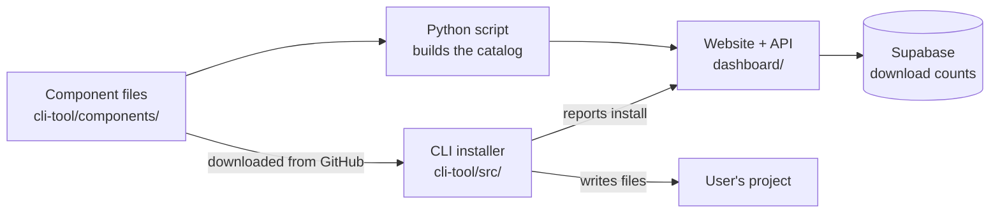
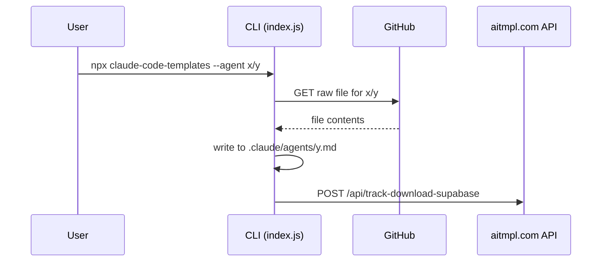

# How This Repo Works

A beginner-friendly guide to `claude-code-templates`, written for backend developers who are new to the project. As of 2026-09-25.

## 1. What does this project do?

It's a collection of add-ons for [Claude Code](https://claude.com/claude-code), plus a tool that installs them.

Think of it like a package manager, but for Claude Code settings and helpers:

- **The add-ons** (called *components*) are plain text files: Markdown and JSON.
- **The installer** is a command-line tool you run with `npx claude-code-templates`.
- **The website** (www.aitmpl.com) lets people browse the add-ons and copy the install command.

Example: running `npx claude-code-templates --agent development-team/backend-architect` downloads one Markdown file and saves it to `.claude/agents/backend-architect.md` in your project.

## 2. Words you'll see

| Word | What it means here |
| --- | --- |
| Component | One add-on: an agent, command, skill, hook, MCP, setting, loop or mod |
| Catalog | A big JSON list of every component, used by the website |
| CLI | The command-line installer (`cli-tool/`) |
| Dashboard | The website (`dashboard/`). Same thing as "the site" |
| API route | A backend endpoint, e.g. `POST /api/track-download-supabase` |
| Cloudflare Pages | Where the website and its API routes are hosted |
| Cloudflare Worker | A small script Cloudflare runs on a schedule (like a cron job) |
| Supabase / Neon | The two hosted Postgres databases the backend uses |

## 3. The whole system in one picture



How to read it:

1. Someone adds a component file to the repo.
2. A Python script reads all the component files and builds the catalog (JSON).
3. The website shows the catalog. A user copies an install command.
4. The CLI downloads the component **straight from GitHub** and saves it into the user's project.
5. The CLI tells our API "this was installed", and the API saves that in Supabase.

**The most important thing to understand:** the CLI does not contain the components. It downloads them from GitHub every time. So a new component works as soon as it's merged to `main`, with no new CLI release.

## 4. Where things live

You only need to know six folders to start:

| Folder | What's inside | Language |
| --- | --- | --- |
| `cli-tool/components/` | All the add-ons (thousands of `.md` and `.json` files) | Markdown, JSON |
| `cli-tool/src/` | The CLI installer's code | Node.js (CommonJS) |
| `dashboard/src/pages/api/` | The backend API endpoints | TypeScript |
| `scripts/` | Build scripts, mainly the catalog builder | Python |
| `cloudflare-workers/` | Scheduled jobs (health checks, weekly reports) | JavaScript |
| `.github/workflows/` | CI: tests, deploys, automatic catalog updates | YAML |

You can ignore these at first: `docs/` (old website), `cli-rust/` (experimental Rust version of the CLI), `cli-tool/analytics-ui/` and the other local dashboards.

## 5. The components

Each component is a file at `cli-tool/components/<type>/<category>/<name>`. The folder path is also its install name.

| Type | File | Gets installed to | Count |
| --- | --- | --- | --- |
| Agent | `.md` | `.claude/agents/` | 424 |
| Command | `.md` | `.claude/commands/` | 348 |
| Skill | a folder with `SKILL.md` | `.claude/skills/<name>/` | 912 |
| MCP | `.json` | merged into `.mcp.json` | 104 |
| Setting | `.json` | merged into a `settings.json` | 72 |
| Hook | `.json` (+ optional `.py`/`.sh`) | merged into a `settings.json` | 62 |
| Loop | `.md` | `.claude/loops/`, plus everything it lists | 18 |
| Mod | a plugin folder | `.claude/skills/<name>/` | 29 |

Two rules of thumb:

- **Markdown components** (agents, commands) are copied as-is.
- **JSON components** (MCPs, settings, hooks) are *merged* into a file the user already has, so we don't overwrite their config.

## 6. The CLI: how an install works

Code: `cli-tool/bin/create-claude-config.js` (the entry point) and `cli-tool/src/index.js` (almost everything else).



Step by step in the code:

1. `bin/create-claude-config.js` reads the flags with the `commander` library.
2. It calls `createClaudeConfig(options)` in `src/index.js`. This function checks the flags one by one and runs the matching feature.
3. For install flags it calls `installMultipleComponents()`, which calls one function per component, e.g. `installIndividualAgent()`.
4. That function downloads the file with `fetch()` and writes it with `fs-extra`.
5. `src/tracking-service.js` sends an anonymous "installed" event to our API. Users can turn this off with `CCT_NO_TRACKING=true`.

**Good first read:** `installIndividualAgent()` in `cli-tool/src/index.js`. It's about 70 lines and shows the whole pattern.

Run the tests with `cd cli-tool && npx jest`.

## 7. The backend API

The API lives inside the website project, in `dashboard/src/pages/api/`. Each file is one endpoint. The framework is Astro, but the endpoints are like small Express handlers: you export a `GET` or `POST` function that gets a request and returns a response.

The endpoints that matter most:

| Endpoint | Who calls it | What it does | Database |
| --- | --- | --- | --- |
| `POST /api/track-download-supabase` | The CLI, on every install | Saves one download row | Supabase |
| `POST /api/track-installation-outcome` | The CLI | Saves whether the install worked | Supabase |
| `GET /api/claude-code-check` | A scheduled Worker, every 30 min | Checks for new Claude Code releases, posts to Discord | Neon |
| `GET /api/health-check` | A scheduled Worker, hourly | Checks the site is healthy | none |
| `/api/collections/*` | The website (logged-in users) | Save and share lists of components | Neon |
| `POST /api/discord/interactions` | Discord | Answers the Discord bot's slash commands | none |

Helpers you'll reuse:

- `dashboard/src/lib/api/cors.ts`: `jsonResponse()` and `corsResponse()` for building responses.
- `dashboard/src/lib/api/neon.ts`: gets a Neon database client.
- `dashboard/src/lib/api/auth.ts`: checks the logged-in user (Clerk).
- `dashboard/src/middleware.ts`: makes secrets available as `process.env.X`.

**Secrets are never written in code.** Locally they go in `.env` (see `.env.example`). In production they're set with `wrangler pages secret put NAME`.

Run it locally:

```bash
cd dashboard
npm install
npx astro dev --port 4321
# API is now at http://localhost:4321/api/...
```

## 8. Databases

| Database | Used for | Where the schema is |
| --- | --- | --- |
| Supabase (Postgres) | Download and usage events. The main table is `component_downloads` | Managed in Supabase |
| Neon (Postgres) | Claude Code release history, user collections, command usage logs | `database/migrations/`, `dashboard/src/lib/live-task/migration.sql` |

## 9. The catalog builder

`scripts/generate_components_json.py` reads every component file and writes the JSON files the website loads (into `docs/` and `dashboard/public/`).

```bash
python scripts/generate_components_json.py --skip-downloads   # fast: seconds
python scripts/generate_components_json.py                    # slow: also pulls download counts from Supabase
```

Important: **these JSON files are generated. Never edit them by hand.** CI rebuilds them automatically after every merge and once a day. If you're contributing from a fork, don't commit them at all, or a CI check will fail your PR.

## 10. Scheduled jobs (Cloudflare Workers)

Each folder in `cloudflare-workers/` is a tiny standalone program that Cloudflare runs on a timer. Think of each one as a cron job.

| Worker | Runs | Does |
| --- | --- | --- |
| `crons` | Every 30 min and hourly | Calls `/api/claude-code-check` and `/api/health-check` |
| `pulse` | Sundays | Sends a weekly stats report to Telegram |
| `daily-health-report` | Daily | Sends a site health + error summary to Telegram |
| `newsletter` | Paused | Weekly email (currently switched off) |

They're deployed by hand: `cd cloudflare-workers/<name> && npx wrangler deploy`.

## 11. How code gets to production

| What changed | What happens |
| --- | --- |
| Anything in `dashboard/` merged to `main` | GitHub Actions builds and deploys the site automatically |
| A component merged to `main` | Users can install it right away; CI rebuilds the catalog |
| CLI code in `cli-tool/src/` | Nothing automatic. A maintainer publishes a new npm version by hand |
| A Worker | Nothing automatic. Deploy it by hand with `wrangler` |

## 12. Your first week

Suggested reading order, about an hour in total:

1. `cli-tool/bin/create-claude-config.js`: see all the CLI flags.
2. `installIndividualAgent()` in `cli-tool/src/index.js`: see one install from start to finish.
3. One agent file, e.g. `cli-tool/components/agents/development-team/backend-architect.md`.
4. `dashboard/src/pages/api/track-download-supabase.ts`: the endpoint the CLI calls.
5. `dashboard/src/lib/api/cors.ts` and `neon.ts`: the shared API helpers.
6. `cloudflare-workers/crons/index.js`: a scheduled job that calls the API.

After that you've followed one component all the way from the file to the database.

## 13. Known rough edges

These looked wrong while this guide was being written. They haven't been tested.

- `run_security_validation()` in `scripts/generate_components_json.py` looks for `scripts/cli-tool/`, which doesn't exist. So the `security` field in the catalog is probably always empty.
- The workflows that rebuild the catalog push with `GITHUB_TOKEN`. GitHub doesn't start other workflows from those pushes, so the site may only pick up new catalog data on the next deploy that does run.

For more detail on any part, see `CLAUDE.md` at the repo root.
